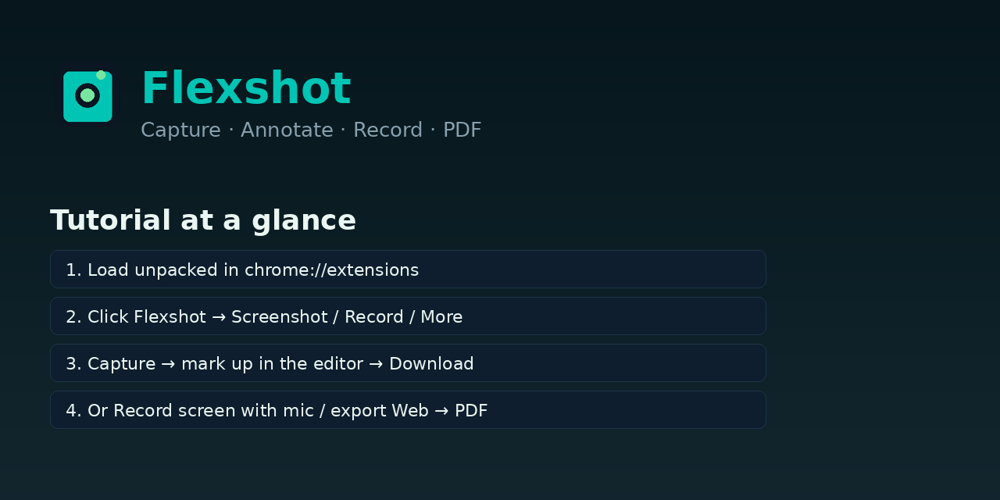
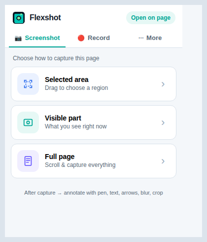
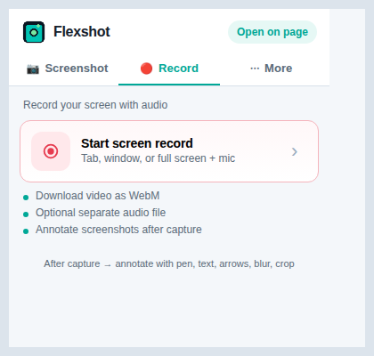
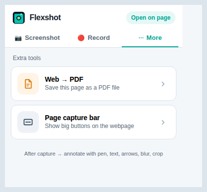
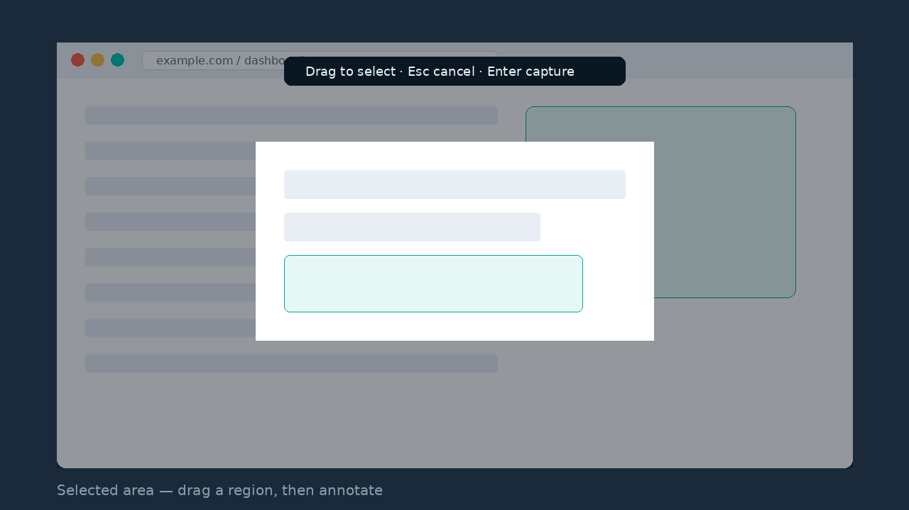
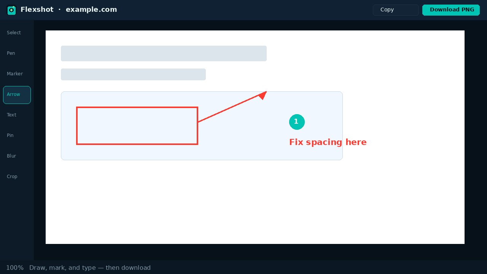
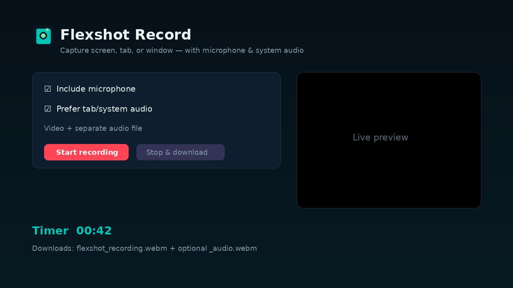
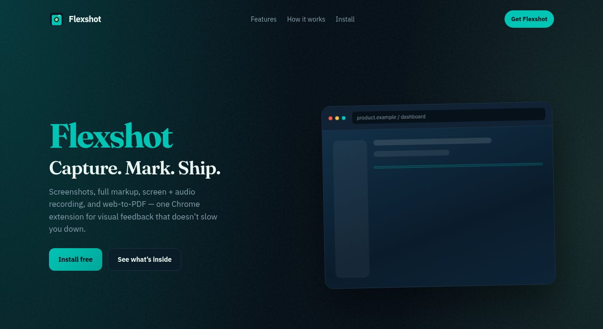
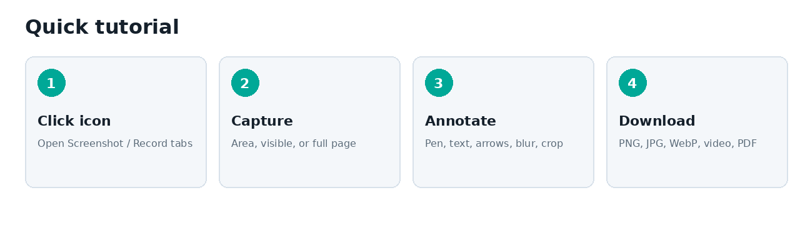
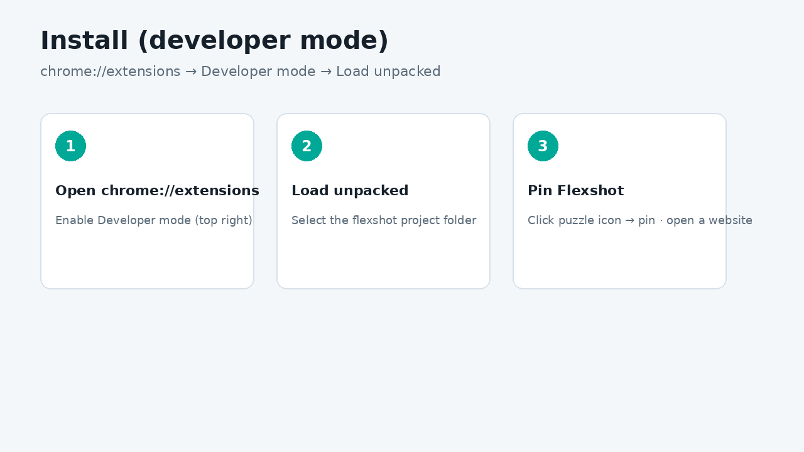

# Flexshot

[](LICENSE)
[](manifest.json)
[](CONTRIBUTING.md)

**Capture. Annotate. Record. Export.**

Flexshot is an open-source Chrome extension for screenshots, full image annotation, screen recording with audio, and web → PDF — built for fast visual communication.

**Repo:** [github.com/salesbotics/flexshot](https://github.com/salesbotics/flexshot)

<p align="center">
  
</p>

---

## Screenshots

### Popup — pick Screenshot, Record, or More

| Screenshot tab | Record tab | More tab |
|:---:|:---:|:---:|
|  |  |  |

### Capture & annotate

| Select a region | Annotation editor |
|:---:|:---:|
|  |  |

### Record & marketing

| Screen recorder | Landing page |
|:---:|:---:|
|  |  |

---

## Quick tutorial

<p align="center">
  
</p>

### Step-by-step

#### 1. Install (developer / from source)

<p align="center">
  
</p>

```bash
git clone git@github.com:salesbotics/flexshot.git
cd flexshot
```

1. Open Chrome → `chrome://extensions`
2. Enable **Developer mode**
3. Click **Load unpacked** → select the `flexshot` folder
4. Pin Flexshot and open a normal webpage (not `chrome://…`)

#### 2. Choose what to capture

Click the Flexshot icon. Use the tabs:

- **Screenshot** → Selected area · Visible part · Full page  
- **Record** → Start screen record (tab / window / screen + mic)  
- **More** → Web → PDF · Page capture bar  

Tip: click **Open on page** for a floating menu on the webpage, or right‑click → **Flexshot**.

**Shortcuts:** `Alt+Shift+V` visible · `Alt+Shift+R` region · `Alt+Shift+F` full page

#### 3. Annotate

After a capture, the editor opens. Use:

- Pen, marker, arrow, line, rectangle, ellipse  
- Text and numbered pins  
- Blur / redact and crop  
- Undo / redo, zoom, **Copy**, **Download** (PNG / JPG / WebP)

#### 4. Record or export PDF

- **Record** → set mic / system audio → Start → Stop & download (WebM video + optional audio file)  
- **Web → PDF** → Flexshot scrolls the page and downloads a multi-page PDF

---

## Features

| Mode | What it does |
|------|----------------|
| **Selected area** | Drag to capture a region |
| **Visible part** | Capture the current viewport |
| **Full page** | Scroll-stitch the whole page |
| **Annotate** | Pen, marker, arrows, shapes, text, pins, blur, crop, undo/redo |
| **Export** | Download PNG / JPG / WebP or copy to clipboard |
| **Record** | Screen / tab / window + mic & system audio; video + optional separate audio file |
| **Web → PDF** | Save the page as a multi-page PDF |

---

## Project structure

```
flexshot/
├── manifest.json          # Chrome MV3 manifest
├── icons/                 # Extension icons
├── docs/screenshots/      # README tutorial images
├── src/
│   ├── background/        # Service worker (capture, PDF, downloads)
│   ├── popup/             # Tabbed Capture / Record menu
│   ├── content/           # Region select, full-page, on-page launcher
│   ├── editor/            # Annotation workspace
│   ├── record/            # Screen + audio recorder
│   └── offscreen/         # Crop, stitch, PDF helpers
├── marketing/             # Landing page + Web Store listing copy
├── CONTRIBUTING.md        # How to contribute
└── LICENSE
```

---

## Privacy

All captures and recordings stay on your device. Flexshot does not require an account and does not upload your media.

---

## Requirements

- Google Chrome **116+** (Manifest V3, `offscreen`, `storage.session`)
- Works best on regular `http://` / `https://` pages

---

## Contributing

Contributions are welcome — bug fixes, features, docs, and UX polish.

👉 Read **[CONTRIBUTING.md](CONTRIBUTING.md)** for setup, branch naming, PR checklist, and code style.

```bash
git clone git@github.com:salesbotics/flexshot.git
cd flexshot
git checkout -b feat/your-idea
# make changes, test as Load unpacked
git push -u origin feat/your-idea
# open a Pull Request on GitHub
```

---

## Marketing / Chrome Web Store

Open [`marketing/index.html`](marketing/index.html) for the product landing page and store listing draft copy.

All tutorial images live in [`docs/screenshots/`](docs/screenshots/).

---

## License

MIT — see [LICENSE](LICENSE).

---

## Maintainers

Built and maintained by [Salesbotics](https://github.com/salesbotics).

Questions or ideas? Open an [issue](https://github.com/salesbotics/flexshot/issues) or a pull request.
